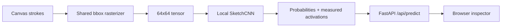

# SketchNet Lab

SketchNet Lab is a local Quick, Draw! experiment: draw on a canvas, watch the same 64×64 rasterized input sent to a small PyTorch CNN, and inspect measured probabilities and final convolution channels. Runtime inference uses no LLM or network service.

## Start with the visual explanation

If you are new to the project, begin with the interactive explainer. It explains the complete path from a hand-drawn stroke to the shared rasterizer, the 64×64 tensor, the local CNN, measured probabilities, convolution activations, and the browser inspector.

**[Open the SketchNet interactive system explainer](https://swrtan.github.io/sketchnet/)**

After the explanation, try the actual local application by following the setup and run instructions below. The explainer and the app are separate on purpose: one teaches the pipeline, the other runs real local inference.

## Setup

```powershell
py -3.13 -m venv .venv
.\.venv\Scripts\python.exe -m pip install -e ".[dev]"
```

Download a bounded recognized subset (the default is 1,500 drawings per class):

```powershell
.\.venv\Scripts\python.exe scripts\download_data.py --sample-count 1500
```

Train and evaluate the reproducible baseline:

```powershell
.\.venv\Scripts\python.exe scripts\train.py --epochs 10 --device auto
.\.venv\Scripts\python.exe scripts\evaluate.py --split validation
.\.venv\Scripts\python.exe scripts\evaluate.py --split test
```

Start the local application:

```powershell
.\.venv\Scripts\python.exe -m uvicorn sketchnet.server:app --app-dir src --host 127.0.0.1 --port 8877
```

Open <http://127.0.0.1:8877/>. If Quick, Draw! is unavailable, the pipeline can still be exercised with a local `.npz` fixture made with `sketchnet.data.save_dataset`; no metrics should be reported as trained results until a genuine checkpoint exists.

## Architecture



The ten classes are defined once in `src/sketchnet/config.py`. Downloaded vectors are cached by class and sample count, split deterministically 70/15/15 by class, and carry a preprocessing version. Evaluation stores JSON metrics, confusion matrices, confidence histograms, representative errors, and training curves under `artifacts/`.

Quick, Draw! simplified vectors are provided by Google under CC BY 4.0; see the linked project documentation in `implementation-plan.md`.
